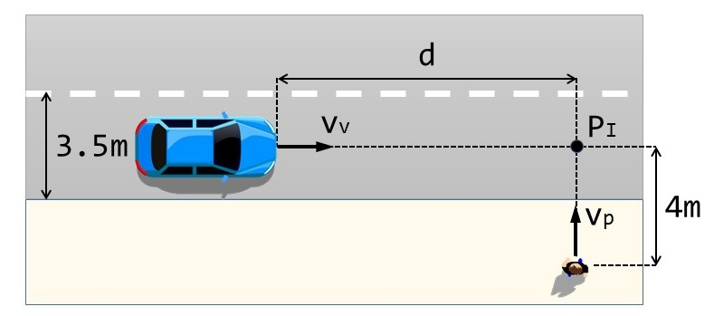
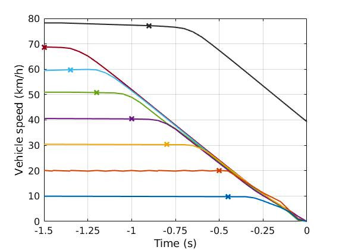
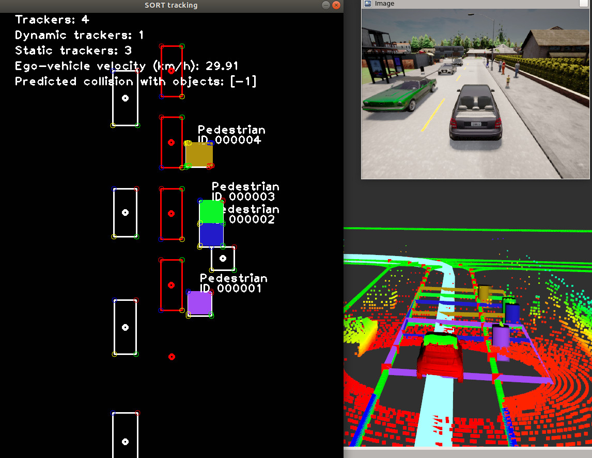

# SmartMOT
SmartMOT: Exploiting the fusion of HD Maps and Multi-Object Tracking for Real-Time Motion Prediction in Intelligent Vehicles applications

## Overview
Behaviour prediction in multi-agent and dynamic environments is crucial in the context of intelligent vehicles, due to the complex interactions and representations of road participants (such as vehicles, cyclists or pedestrians) and road context information (e.g. traffic lights, lanes and regulatory elements). This paper presents SmartMOT, a simple yet powerful pipeline that fuses the concepts of tracking-by-detection and semantic information of HD maps, in particular using the OpenDrive format specification to describe the road network's logic, to design a real-time and power-efficient Multi-Object Tracking (MOT) pipeline which is then used to predict the future trajectories of the obstacles assuming a CTRV (Constant Turn Rate and Velocity) model. The system pipeline is fed by the monitorized lanes around the ego-vehicle, which are calculated by the planning layer, the ego-vehicle status, that contains its odometry and velocity and the corresponding Bird's Eye View (BEV) detections. Based on some well-defined traffic rules, HD map geometric and semantic information are used in the initial stage of the tracking module, made up by a BEV Kalman Filter and Hungarian algorithm are used for state estimation and data association respectively, to track only the most relevant detections around the ego-vehicle, as well as in the subsequent steps to predict new relevant traffic participants or delete trackers that go outside the monitorized area, helping the perception layer to understand the scene in terms of behavioural use cases to feed the executive layer of the vehicle. First, our system pipeline is described, exploiting the concepts of lightweight Linux containers using Docker to provide the system with isolation, flexibility and portability, and standard communication in robotics using the Robot Operating System (ROS). Second, the system is validated ([Qualitative Results](https://cutt.ly/uk9ziaq)) in the CARLA simulator fulfilling the requirements of the Euro-NCAP evaluation for Unexpected Vulnerable Road Users (VRU), where a pedestrian suddenly jumps into the road and the vehicle has to avoid collision or reduce the impact velocity as much as possible. Finally, a comparison between our HD map based perception strategy and our previous work with rectangular based approach is carried out, demonstrating how incorporating enriched topological map information increases the reliability of the Autonomous Driving (AD) stack. Code is publicly available ([Code](https://github.com/Cram3r95/map-filtered-mot)) as a ROS package.

## Requirements

Note that due to ROS1 limitations (till Noetic version), specially in terms of TF ROS package, we limited the Python version to 2.7. Future works will integrate the code using ROS1 Noetic or ROS2, improving the version to Python3.

- Python2.7 
- Numpy
- ROS melodic
- HD map information (Monitorized lanes)
- Keras==2.2.4
- OpenCV==4.1.2
- filterpy==1.4.5
- scikit-image==0.17.2
- lap==0.4.0

## Get Started and Usage
Coming soon ...
## Quantitative results
Coming soon ...

## Qualitative results

